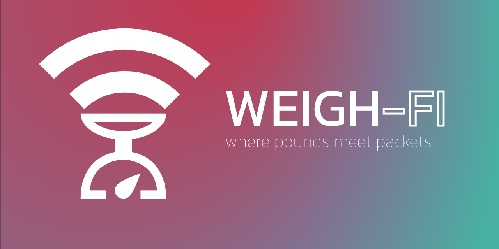
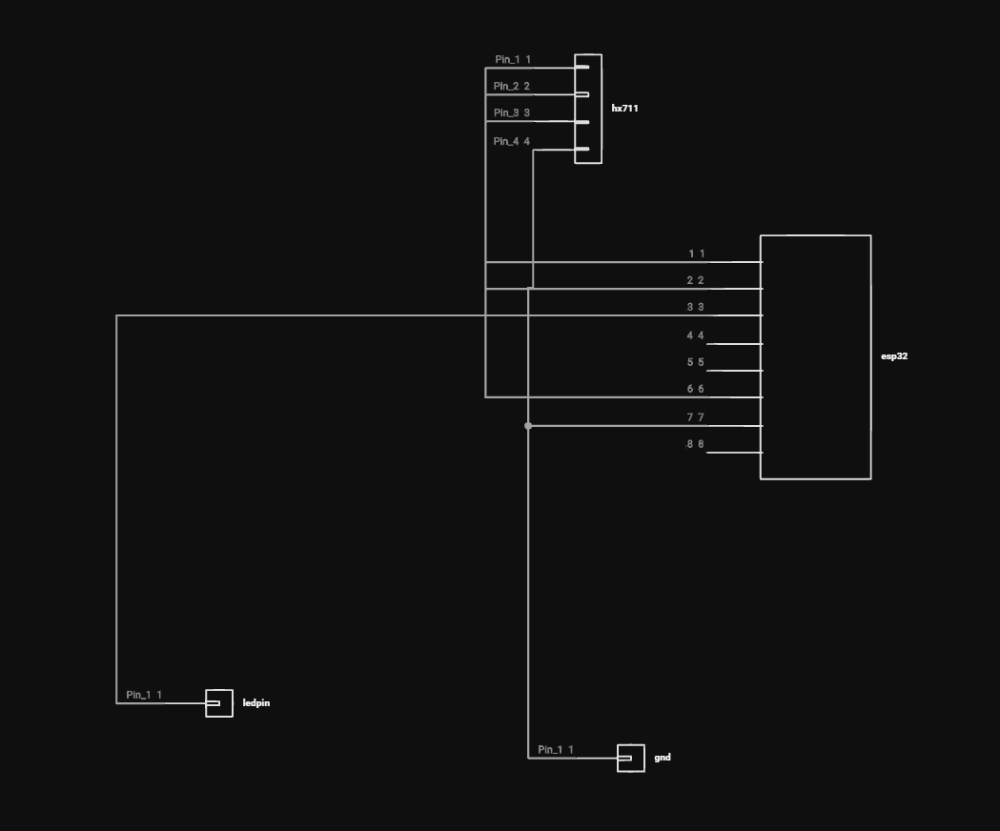
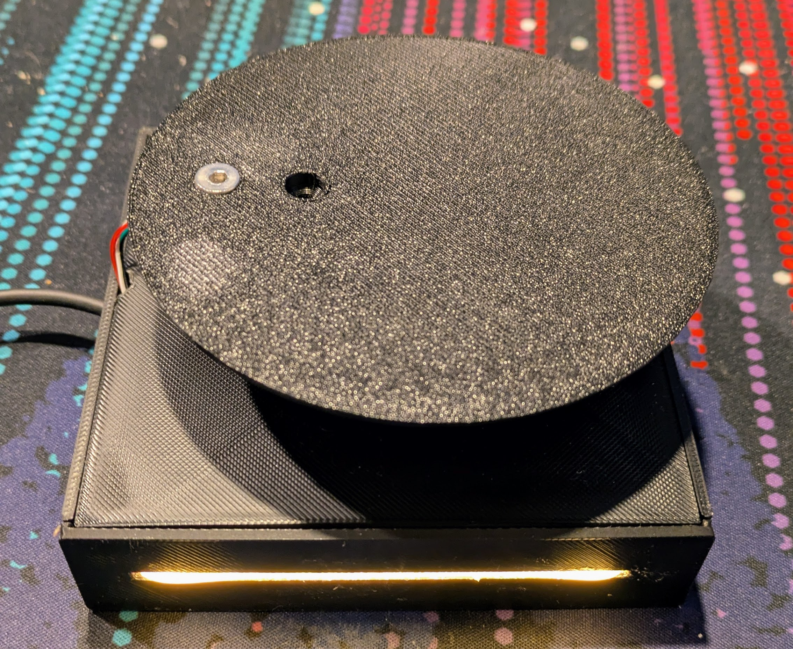
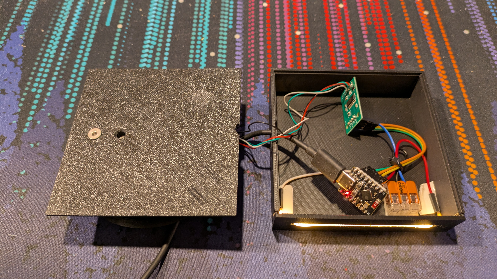

# Weigh-fi

## Introduction

Weigh-fi is a WiFi-enabled scale with API access, allowing users to easily add weight measurements when using ThalamOS.

## Features

- **LED Indicator Light**: Provides visual feedback for the device status.
- **API**: Offers a robust API for seamless integration and control.
- **Easy Integration**: Compatible with ThalamOS versions greater than 0.2 for effortless setup.

## Setup

### Build Your Weigh-fi

#### Parts List

- ESP32-C3 Mini
- HX711 controller with weight cell
- LED filament (130mm)
- Some PLA to print your case

#### Wiring Diagram

#### Flash the File

1. Open the `.ino` file in your Arduino library.
2. Set your WiFi credentials.
3. Configure your flash settings as follows:
    - **Board**: ESP32C3 Dev Module
    - **USB CDC on Boot**: Disabled
    - **CPU Frequency**: 160MHz (WiFi)
    - **Core Debug Level**: None
    - **Erase All Flash Before Sketch Upload**: Enabled
    - **Flash Frequency**: 80MHz
    - **Flash Mode**: QIO
    - **Flash Size**: 4MB (32Mb)
    - **JTAG Adapter**: Disabled
    - **Partition Scheme**: Default 4MB with spiffs (1.2MB APP/1.5MB SPIFFS)
    - **Upload Speed**: 921600
    - **Zigbee Mode**: Disabled

## Images

## Contributing

Contributions are welcome! Please fork the repository and submit a pull request.

## License

This project is licensed under the [MIT License](LICENSE).

## Contact

For any questions or suggestions, please open an issue or contact the repository owner.

## TODOs

- Add 3D files
- Use Improv library to simplify setup
- Use ESP Web Tools to allow flashing from web
- Create custom PCB